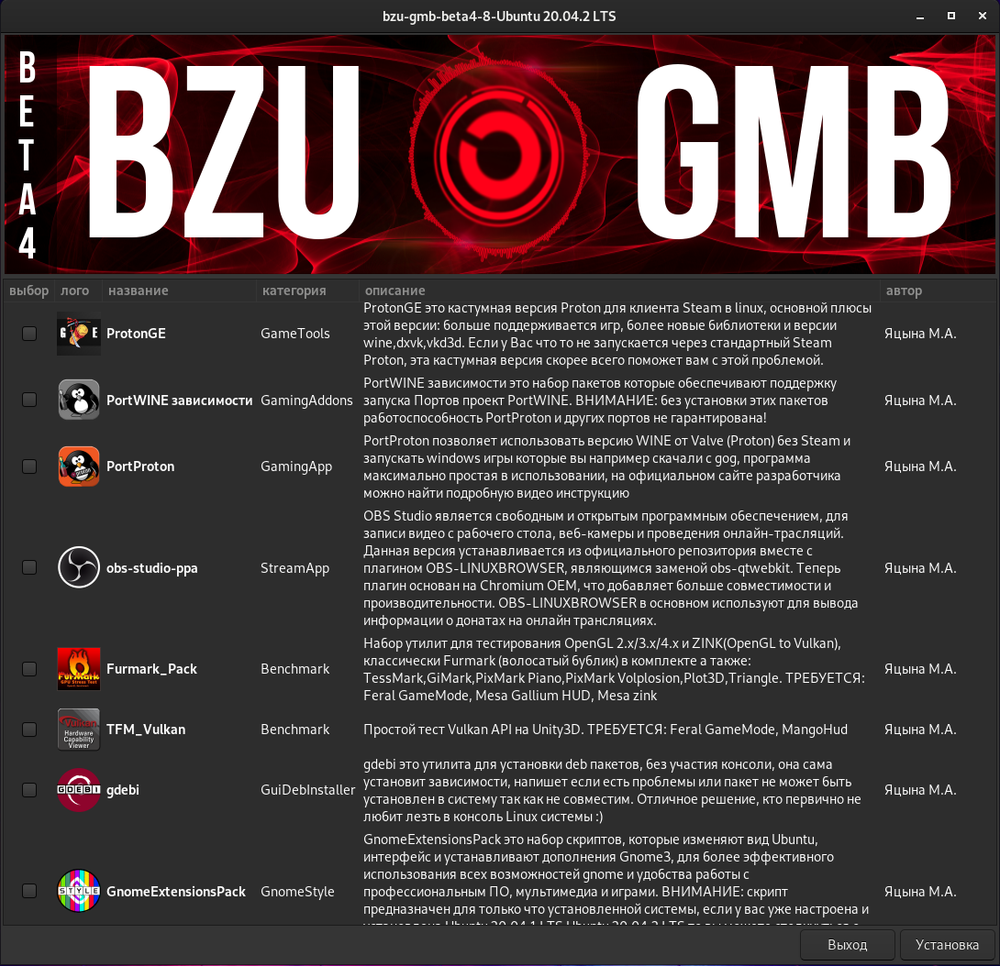

# bzu-gmb
bzu-gmb is auto-installer linux gaming tools,  development, graphic\video editors for Ubuntu\Linux Mint\Debian testing and other debian-based distributions in experimental mode, written in bash using zenity and yad libraries
-----------


Options
-----------
<<<<<<< HEAD
Ready modules : XanMod, Xanmod-cacule, Mesa Oibaf, Mesa Kisak, Feral GameMode, MangoHud, vkBazalt, CoreCtrl, CoreCtrl 2.0, Psensor, inxi, Glances, cpu-x, xboxdrv, Steam Linux, ProtonUp-Qt, ProtonGE, PortWINE adon, PortProton, Furmark_Pack(OpenGL Benchmark, ZINK), TFM_Vulkan(Benchmark), gdebi, GnomeExtensionsPack, mangohud-ppa, vkbasalt-ppa, Goverlay-ppa, obs-studio-ppa, Kdenlive-ppa, SimpleScreenRecorder-ppa, Lossless-Cut-appimage, Blender-ppa, vscodium-portable-1.61.1, visual-studio-code-ppa, godot-ppa, godot-portable, Kate-editor-ppa, Krita-ppa, Inkscape-ppa, GIMP-ppa, pinta-ppa, Celluloid-ppa, Audacity-ppa, Audacious-ppa, Thunderbird-ppa, Qpdf-tools-ppa, Simple-scan-ppa, BackToGnomeVanilla, GnomeExtensionsPack2 for Ubuntu 21.10, GnomeExtensionsPack2 for Debian-testing
=======
Ready modules : XanMod-ppa, Xanmod-cacule-ppa, Liquorix-Kernel-ppa, DisableMitigations, Mesa Oibaf, Mesa Kisak, Feral GameMode, MangoHud, vkBazalt, CoreCtrl 2.0, Psensor, inxi, Glances, cpu-x, xboxdrv, Steam Linux, ProtonUp-Qt, PortWINE adon, PortProton, Furmark_Linux(OpenGL Benchmark, ZINK), TFM_Vulkan(Benchmark), gdebi, GnomeExtensionsPack, mangohud-ppa, vkbasalt-ppa, Goverlay-ppa, obs-studio-ppa, Kdenlive-ppa, SimpleScreenRecorder-ppa, Lossless-Cut-appimage, Blender-ppa, vscodium-portable-1.61.1, visual-studio-code-ppa, godot-ppa, godot-portable, Kate-editor-ppa, Krita-ppa, Inkscape-ppa, GIMP-ppa, pinta-ppa, Celluloid-ppa, Audacity-ppa, Audacious-ppa, Thunderbird-ppa, Qpdf-tools-ppa, Simple-scan-ppa, BackToGnomeVanilla, GnomeExtensionsPack2 for Ubuntu 21.10, GnomeExtensionsPack2 for Debian-testing
>>>>>>> bdae76e61b0ae289dd3b85881afe52abf5bfd652

Installation Ubuntu\Linux Mint:
-----------
Stable version, you can be downloaded in [Releases](https://github.com/redrootmin/bzu-gmb/releases)

[Development version]

In terminal (CTRL+ALT+T) enter commands:
```
cd;rm -rf bzu-gmb*;rm -f bzu-gmb*;rm -f *bzu-gmb;wget https://github.com/redrootmin/bzu-gmb/archive/refs/heads/dev.zip -O bzu-gmb-dev.zip;unzip bzu-gmb-dev.zip;cd ~/bzu-gmb-dev;chmod +x mini_install.sh;bash mini_install.sh
```
[Unstable version] (for testing only)

In terminal (CTRL+ALT+T) enter commands:
```
cd;rm -rf bzu-gmb*;rm -f bzu-gmb*;rm -f *bzu-gmb;wget https://github.com/redrootmin/bzu-gmb/archive/refs/heads/unstable.zip -O bzu-gmb-unstable.zip;unzip bzu-gmb-unstable.zip;cd ~/bzu-gmb-unstable;chmod +x mini_install.sh;bash mini_install.sh
```

Installation Debian-testing[bookworm]:
-----------
[debian preconfiguration]

In terminal enter commands:
<<<<<<< HEAD
```
su
```
```
/sbin/usermod -aG sudo $USER
```
```
echo "deb http://deb.debian.org/debian/ bookworm main contrib non-free" > /etc/apt/sources.list;echo "deb-src http://deb.debian.org/debian/ bookworm main contrib non-free" >> /etc/apt/sources.list;echo "deb http://security.debian.org/ bookworm/updates main contrib non-free" >> /etc/apt/sources.list;echo "deb-src http://security.debian.org/ bookworm/updates main contrib non-free" >> /etc/apt/sources.list;echo "deb http://ftp.debian.org/debian bookworm-backports main contrib non-free" >> /etc/apt/sources.list;echo "deb http://security.debian.org/debian-security bookworm-security main contrib non-free" >> /etc/apt/sources.list;echo "deb-src http://security.debian.org/debian-security bookworm-security main contrib non-free" >> /etc/apt/sources.list
```
=======

step #1
```
su
```
step #2
```
/sbin/usermod -aG sudo $USER
```
step #3
```
echo "deb http://deb.debian.org/debian/ bookworm main contrib non-free" > /etc/apt/sources.list;echo "deb-src http://deb.debian.org/debian/ bookworm main contrib non-free" >> /etc/apt/sources.list;echo "deb http://security.debian.org/ bookworm/updates main contrib non-free" >> /etc/apt/sources.list;echo "deb-src http://security.debian.org/ bookworm/updates main contrib non-free" >> /etc/apt/sources.list;echo "deb http://ftp.debian.org/debian bookworm-backports main contrib non-free" >> /etc/apt/sources.list;echo "deb http://security.debian.org/debian-security bookworm-security main contrib non-free" >> /etc/apt/sources.list;echo "deb-src http://security.debian.org/debian-security bookworm-security main contrib non-free" >> /etc/apt/sources.list
```
step #4
>>>>>>> bdae76e61b0ae289dd3b85881afe52abf5bfd652
```
sudo apt update -y;sudo apt upgrade -y
```
Reboot Debian!
-----------

[Stable version], you can be downloaded in [Releases](https://github.com/redrootmin/bzu-gmb/releases)

[Development version]

In terminal enter commands:
```
cd;rm -rf bzu-gmb*;rm -f bzu-gmb*;rm -f *bzu-gmb;wget https://github.com/redrootmin/bzu-gmb/archive/refs/heads/dev.zip -O bzu-gmb-dev.zip;unzip bzu-gmb-dev.zip;cd ~/bzu-gmb-dev;chmod +x mini_install.sh;bash mini_install.sh
```
<<<<<<< HEAD
[Unstable version] (for testing only)

In terminal enter commands:
```
cd;rm -rf bzu-gmb*;rm -f bzu-gmb*;rm -f *bzu-gmb;wget https://github.com/redrootmin/bzu-gmb/archive/refs/heads/unstable.zip -O bzu-gmb-unstable.zip;unzip bzu-gmb-unstable.zip;cd ~/bzu-gmb-unstable;chmod +x mini_install.sh;bash mini_install.sh
=======
Installation Debian-testing:
-----------

latest version installing in user space
Go to terminal and copy commands:
```
su
```
```
/sbin/usermod -aG sudo $USER
```
```
echo "deb http://deb.debian.org/debian/ bookworm main" >> /etc/apt/sources.list;echo "deb-src http://deb.debian.org/debian/ bookworm main" > /etc/apt/sources.list;echo "deb http://security.debian.org/ bookworm/updates main contrib non-free" > /etc/apt/sources.list;echo "deb-src http://security.debian.org/ bookworm/updates main contrib non-free" > /etc/apt/sources.list;echo "deb http://ftp.debian.org/debian bookworm-backports main contrib non-free" > /etc/apt/sources.list;echo "deb http://security.debian.org/debian-security bookworm-security main contrib non-free" > /etc/apt/sources.list;sudo echo "deb-src http://security.debian.org/debian-security bookworm-security main contrib non-free" > /etc/apt/sources.list
```
reboot Debian!
-----------
```
cd;rm -rf bzu-gmb*;rm -f bzu-gmb*;rm -f *bzu-gmb;wget https://github.com/redrootmin/bzu-gmb/archive/refs/heads/dev.zip -O bzu-gmb-dev.zip;unzip bzu-gmb-dev.zip;cd ~/bzu-gmb-dev;chmod +x mini_install.sh;bash mini_install.sh
>>>>>>> Update README.md
```

TODO:
-----------
- Add Experemintal Mode - DONE
<<<<<<< HEAD
- Add beta49  new functionality, new multimedia modules, customize Ubuntu  - DONE
- Add in beta50 support eng\rus language
- Add in beta50 auto-update-system tools

=======
- Add auto-update-system tools
- Add beta5  new functionality, new multimedia modules, customize Ubuntu  - DONE
- 
>>>>>>> Update README.md
DONATE:
-----------
- [Юmoney] https://donate.stream/gamer-station-on-linux

