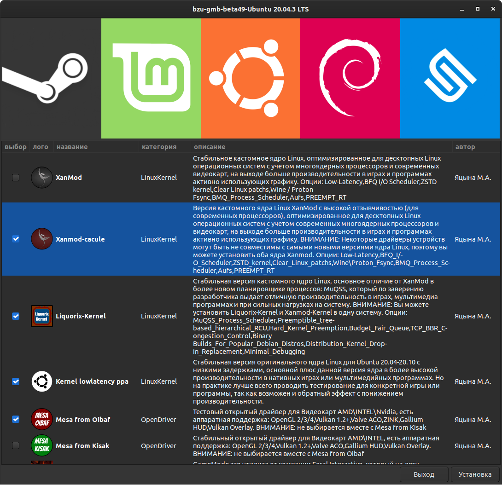

# bzu-gmb
bzu-gmb is auto-installer linux gaming tools,  development, graphic\video editors for Ubuntu/Linux Mint/Debian testing and other debian-based distributions in experimental mode, written in bash using zenity and yad libraries
-----------


Options
-----------
Ready modules : XanMod-ppa, Xanmod-cacule-ppa, Liquorix-Kernel-ppa, Kernel-lowlatency-ppa, DisableMitigations, Mesa-from-Oibaf-ppa, Mesa-from-Kisak-ppa, Feral-GameMode-ppa, MangoHud-ppa, vkBasalt-ppa, Goverlay-ppa, CoreCtrl 2.0, Psensor-ppa, inxi-ppa, Glances, CPU-x-ppa, xboxdrv, Steam-Linux, ProtonUp-Qt, PortWINE-зависимости, PortProton, Furmark-Linux, Refresh2025-Benchmark, OBS-Studio-ppa, Kdenlive-ppa, SimpleScreenRecorder-ppa, Lossless-Cut-appimage, Blender-ppa, VScodium-portable, Visual-Studio-Code-ppa, Godot-ppa, Godot-portable, Kate-editor-ppa, Krita-ppa, Inkscape-ppa, GIMP-ppa, Pinta-ppa, Celluloid-ppa, Audacity-ppa, Audacious-ppa, Thunderbird-ppa, Qpdf-tools-ppa, Simple-scan-ppa, Gdebi-ppa, GnomeExtensionsPack2 - Ubuntu 20.04.3, BackToGnomeVanilla - Ubuntu 20.04.3, GnomeExtensionsPack2 - Ubuntu 21.10, GnomeExtensionsPack3 - Debian[bookworm]-testing

Installation Ubuntu\Linux Mint:
-----------
Stable version, you can be downloaded in [Releases](https://github.com/redrootmin/bzu-gmb/releases)

[Development version]

In terminal (CTRL+ALT+T) enter commands:
```
cd;rm -rf bzu-gmb*;rm -f bzu-gmb*;rm -f *bzu-gmb;wget https://github.com/redrootmin/bzu-gmb/archive/refs/heads/dev.zip -O bzu-gmb-dev.zip;unzip bzu-gmb-dev.zip;cd ~/bzu-gmb-dev;chmod +x mini_install.sh;bash mini_install.sh
```
[Unstable version] (for testing only)

In terminal (CTRL+ALT+T) enter commands:
```
cd;rm -rf bzu-gmb*;rm -f bzu-gmb*;rm -f *bzu-gmb;wget https://github.com/redrootmin/bzu-gmb/archive/refs/heads/unstable.zip -O bzu-gmb-unstable.zip;unzip bzu-gmb-unstable.zip;cd ~/bzu-gmb-unstable;chmod +x mini_install.sh;bash mini_install.sh
```

Installation Debian-testing[bookworm]:
-----------
[debian preconfiguration]

In terminal enter commands:

step #1
```
su
```
step #2
```
/sbin/usermod -aG sudo $USER
```
step #3
```
echo "deb http://deb.debian.org/debian/ bookworm main contrib non-free" > /etc/apt/sources.list;echo "deb-src http://deb.debian.org/debian/ bookworm main contrib non-free" >> /etc/apt/sources.list;echo "deb http://security.debian.org/ bookworm/updates main contrib non-free" >> /etc/apt/sources.list;echo "deb-src http://security.debian.org/ bookworm/updates main contrib non-free" >> /etc/apt/sources.list;echo "deb http://ftp.debian.org/debian bookworm-backports main contrib non-free" >> /etc/apt/sources.list;echo "deb http://security.debian.org/debian-security bookworm-security main contrib non-free" >> /etc/apt/sources.list;echo "deb-src http://security.debian.org/debian-security bookworm-security main contrib non-free" >> /etc/apt/sources.list
```
step #4
```
sudo apt update -y;sudo apt upgrade -y
```
Reboot Debian!
-----------

[Stable version], you can be downloaded in [Releases](https://github.com/redrootmin/bzu-gmb/releases)

[Development version]

In terminal enter commands:
```
cd;rm -rf bzu-gmb*;rm -f bzu-gmb*;rm -f *bzu-gmb;wget https://github.com/redrootmin/bzu-gmb/archive/refs/heads/dev.zip -O bzu-gmb-dev.zip;unzip bzu-gmb-dev.zip;cd ~/bzu-gmb-dev;chmod +x mini_install.sh;bash mini_install.sh
```
[Unstable version] (for testing only)

In terminal enter commands:
```
cd;rm -rf bzu-gmb*;rm -f bzu-gmb*;rm -f *bzu-gmb;wget https://github.com/redrootmin/bzu-gmb/archive/refs/heads/unstable.zip -O bzu-gmb-unstable.zip;unzip bzu-gmb-unstable.zip;cd ~/bzu-gmb-unstable;chmod +x mini_install.sh;bash mini_install.sh
```

TODO:
-----------
- Add Experemintal Mode - DONE
- Add beta49  new functionality, new multimedia modules, customize Ubuntu  - DONE
- Add in beta50 support eng\rus language
- Add in beta50 auto-update-system tools

DONATE:
-----------
- [Юmoney] https://donate.stream/gamer-station-on-linux
