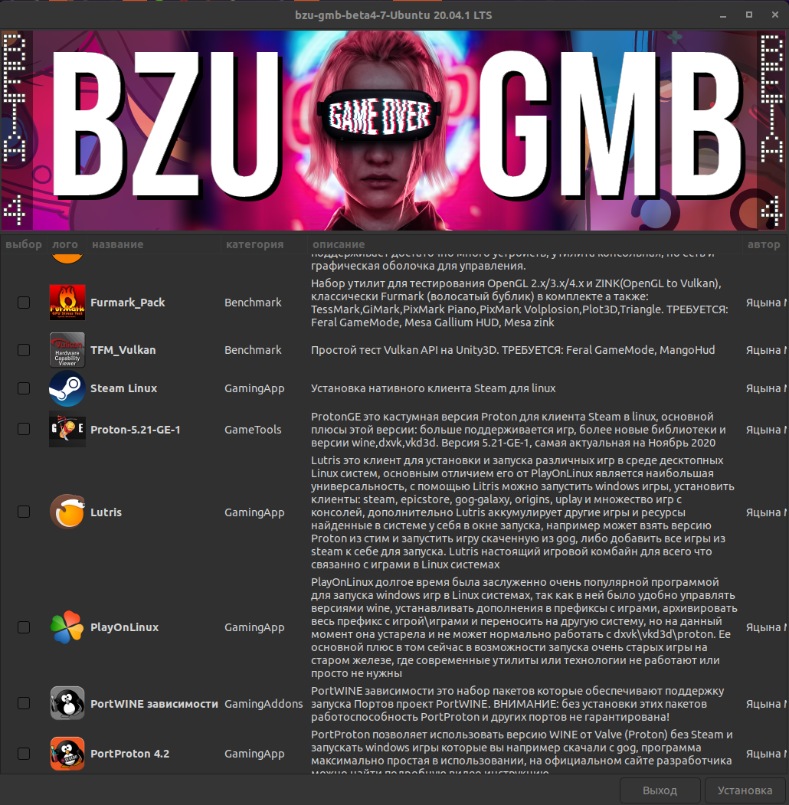

# bzu-gmb
bzu-gmb is auto-installer linux gaming tools for debian-based distributions , bzu-gmb created on bash with the use of zenity, yad libraries
----

Options bzu-gmb-beta4
----------
Ready modules for Ubuntu: XanMod, Xanmod-edge, Mesa Oibaf, Mesa Kisak, Feral GameMode, MangoHud, vkBazalt, Goverlay, CoreCtrl, Furmark_Pack(OpenGL Benchmark), TFM_Vulkan(Benchmark).

For Linux Mint 19.3 not ready: Feral GameMode, CoreCtrl.

FAQ for install beta4:
------------

go to [release](https://github.com/redrootmin/bzu-gmb/releases)

download last version bzu-gmb in to user space (/home/user/)

go to terminal and inter commands:

tar -xpJf bzu-gmb-beta4-installer.tar.xz

cd ~/bzu-gmb

chmod +x bzu-gmb-beta4-installer.sh

./bzu-gmb-beta4-installer.sh

To Do:
-----

-now modules: psensor+config, new benchmarks, protonGE for steam, proton-rdr2, portwine ports

-support re-os(testing)

-support pop!_os(testing)

-now modules and update old

-testing now modele from other authors (if they will)

-now version beta5: fix bugs, new function, test new modules for multimedia, visualization Ubuntu

